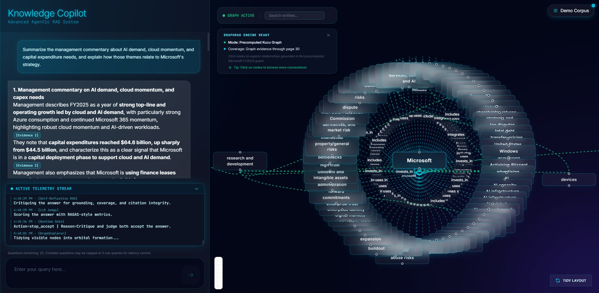

# Agentic Document Intelligence

Production-grade multi-source RAG system for complex document intelligence across vector search, GraphRAG, and SQL. This project is built as a full-stack AI product rather than a notebook demo: retrieval engineering, answer-quality control, orchestration, frontend UX, and public AWS deployment are all part of the system design.

## Why This Is A Strong Senior-Level AI Project

- It tackles real RAG failure modes instead of only showing a happy-path chatbot.
- It combines multiple retrieval paradigms rather than depending on a single vector store.
- It treats answer quality as a systems problem with critique, correction, evaluation, and bounded runtime control.
- It includes production-facing concerns such as latency policy, serverless state management, deployment packaging, and frontend observability.
- It exposes evidence, citations, telemetry, graph context, and downloadable demo assets in a usable product interface.

## Frontend UI

The project includes a full user-facing interface for demo hydration, question answering, graph exploration, citation inspection, telemetry, scoring, and downloadable demo assets.



## Why This Project Matters

Most RAG demos break down as soon as questions become realistic:

- one question actually contains several sub-questions
- the answer requires both unstructured document evidence and structured data
- retrieved chunks are redundant, noisy, or too small to answer well
- graph retrieval is useful structurally but weak textually
- the model gives a plausible answer without enough grounding
- follow-up questions depend on previous turns
- local prototypes work, but serverless production deployment breaks stateful assumptions

This system was built to solve those problems end to end.

## What The System Does

The demo corpus uses a Microsoft FY2025 10-K style workflow, but the architecture is meant for broader enterprise document intelligence use cases:

- multi-hop question answering over long documents
- retrieval across vector, graph, and SQL sources
- grounded answers with citations
- reflective quality control and bounded correction
- conversational follow-up resolution
- frontend evidence inspection, graph view, telemetry, and downloadable demo assets
- deployment on AWS Lambda + API Gateway + S3 + CloudFront

## Design Principles

- Retrieval should be specialized, not monolithic.
- The system should prefer grounded evidence over model guesswork.
- Answer quality should be measured and corrected, not assumed.
- Latency matters, but not at the expense of correctness on complex queries.
- Serverless deployment should not break conversational behavior, runtime state, or observability.

## Performance And Production Engineering

This project is not only about retrieval quality. A large part of the engineering work was making a complex RAG stack fast enough, safe enough, and production-compatible enough to behave like a real application.

- Parallel-safe orchestration
  - Independent retrieval branches can execute concurrently instead of forcing everything through one serial path.
  - This was implemented for safe source combinations such as graph plus vector and graph plus SQL when dependency analysis allows it.

- Latency-optimized orchestration policy
  - The system chooses execution shapes based on query complexity, source mix, dependency structure, and answer risk.
  - This avoids paying the highest-cost path for every query while still preserving quality on difficult ones.

- Bounded runtime quality gating
  - Retries are not open-ended.
  - The system tracks repair budgets, rerun limits, and non-improving retries so it can recover when useful but avoid infinite correction loops.

- Context packaging and evidence reduction
  - Retrieval outputs are merged, deduplicated, reranked, diversified, fused, and optionally compressed before answer generation.
  - This reduces noise, token waste, and answer instability.

- Serverless-safe state architecture
  - Long-running jobs, session state, and runtime artifacts were adapted for Lambda instead of assuming local in-memory processes.
  - Runtime assets are hydrated from S3, and serverless job flow remains observable through the frontend telemetry model.

- Frontend observability
  - The UI does not just show a final answer.
  - It surfaces telemetry, graph context, citations, evaluation signals, and downloadable assets so runtime behavior is inspectable rather than opaque.

## Architecture At A Glance

```text
User Query
  -> Guardrails
  -> Conversational Resolution
  -> Query Decomposition
  -> Query Transformations
       -> Multi-Query
       -> Step-Back
       -> HyDE
  -> Transformation Gating
  -> Multi-Source Routing
  -> Latency-Aware Orchestration
  -> Retrieval Execution
       -> Pinecone Hybrid Search
       -> Parent-Child Retrieval
       -> GraphRAG over Kuzu
       -> Text-to-SQL over SQLite
  -> Merge / Dedup / Rerank / MMR
  -> Cross-Source Evidence Fusion
  -> Citation-Preserving Contextual Compression
  -> Grounded Answer Generation
  -> Self-Reflective Critique
  -> Corrective Repair
  -> RAGAS-Style LLM Judge
  -> Runtime Quality Gating
  -> Final Answer + Citations + Telemetry + Follow-Up Memory
```

## AI Components And Why They Exist

### 1. Corpus Preparation And Retrieval Foundation

The document pipeline is not just "embed a PDF and search it."

- Layout-aware text extraction and cleaning
  - Problem: raw PDF extraction often produces broken line order, duplicated headers, and poor chunk quality.
  - Why it matters: retrieval quality starts with the quality of the text representation.

- Chunk generation and embedding-ready records
  - Problem: documents are too large for direct retrieval.
  - Why it matters: chunking creates retrieval units, while embedding-ready records preserve the metadata needed later for citations and answer assembly.

- Sparse index plus Pinecone hybrid retrieval
  - Problem: dense embeddings alone are weak on precise terms, figures, names, and exact phrasing.
  - Why it matters: hybrid dense plus sparse retrieval improves recall for real business questions with entity-heavy or terminology-heavy wording.

### 2. Parent-Child Retrieval And Small-to-Big Retrieval

- Child chunks are retrieved from Pinecone.
- Parent context is restored from local or runtime artifacts.

Problem it solves:
- small chunks improve retrieval precision but often lose enough surrounding context that answers become brittle or incomplete
- large chunks preserve context but hurt retrieval precision and increase noise

Why this design is better:
- retrieve small units for precision
- expand to parent context only after retrieval for completeness
- preserve child-to-parent provenance for citations

This is effectively a small-to-big retrieval strategy: narrow first, then restore the larger context only where justified.

### 3. Query Transformation

Real users rarely ask questions in the best retrieval form. The system therefore uses multiple transformation strategies, each targeting a different failure mode.

- Query decomposition
  - Problem: one user message may contain several dependent tasks.
  - Why: splitting a complex ask into smaller retrieval problems improves routing and evidence coverage.

- Query decomposition repair
  - Problem: LLM decomposition can miss or distort sub-questions.
  - Why: a repair step improves reliability before retrieval starts.

- Multi-query generation
  - Problem: one surface form of a query may miss relevant evidence that uses different wording.
  - Why: paraphrase-style retrieval variants improve recall.

- Step-back query generation
  - Problem: literal user phrasing may be too narrow or too specific to retrieve the conceptual evidence needed.
  - Why: a higher-level abstraction query helps retrieve broader explanatory context.

- HyDE
  - Problem: some difficult questions have poor lexical overlap with the source text.
  - Why: generating a hypothetical answer-shaped retrieval query can surface relevant evidence that direct retrieval misses.

- Corrective HyDE retry
  - Problem: first-pass retrieval can still be weak.
  - Why: a bounded corrective retry improves difficult cases without allowing unbounded loops.

- Transformation gating
  - Problem: running every transformation every time is expensive and unnecessary.
  - Why: the system decides when deeper transformation is justified, balancing quality and latency.

### 4. Retrieval Execution Quality Controls

Once transformed queries are generated, retrieval still needs quality shaping before an answer can be trusted.

- Transformed retrieval executor
  - Problem: multiple transformed sub-queries create many candidate results.
  - Why: execution orchestration keeps retrieval structured and attributable.

- Retrieval merge and dedup
  - Problem: transformed queries often retrieve near-duplicate evidence.
  - Why: dedup reduces wasted context budget and avoids repetitive answers.

- Reranking
  - Problem: raw retrieval order is not always answer-optimal.
  - Why: reranking lifts the most relevant evidence toward the final bundle.

- MMR diversification
  - Problem: top-k results can collapse onto the same local region of the document.
  - Why: Maximal Marginal Relevance improves evidence diversity and reduces redundancy.

- Sub-query coverage scoring
  - Problem: it is easy to answer one part of a multi-part question well while silently missing another part.
  - Why: coverage scoring tracks whether the retrieved evidence actually spans the full ask.

- Final evidence bundle assembly
  - Problem: retrieval outputs are messy and source-specific.
  - Why: the system builds a clean answer-ready bundle while preserving provenance.

### 5. GraphRAG

The graph pipeline is built, not assumed.

- graph extraction input packaging
- entity and relationship extraction
- normalization and deduplication
- schema validation
- Kuzu graph construction
- graph retrieval
- graph evidence packaging

Problem GraphRAG solves:
- vector retrieval is good at semantic text similarity but weaker at explicit relationship traversal
- many business questions are fundamentally relational: company to segment, product to business line, entity to role, entity to entity

Why GraphRAG alone is not enough:
- graph retrieval can be structurally useful but textually weak
- that is why this system pairs graph retrieval with vector retrieval for grounding instead of treating graph as a complete standalone answer source

### 6. SQL Retrieval

- SQLite demo database build
- schema packaging
- text-to-SQL generation
- validation and safe execution
- SQL evidence packaging
- SQL quality evaluation

Problem it solves:
- some questions are best answered from structured numeric data, not by asking an LLM to infer figures from prose

Why SQL matters:
- exact revenue, operating income, rankings, and geography splits should come from structured data when possible
- the system keeps SQL explicitly read-only and validates execution for safety

### 7. Multi-Source Routing And Orchestration

This is where the project moves beyond a single retriever plus a single LLM.

- multi-source routing
  - Problem: not every question should hit every source equally.
  - Why: route each sub-query to the most appropriate evidence sources.

- multi-source orchestration
  - Problem: sub-queries may depend on one another.
  - Why: the executor resolves dependent and independent retrieval flows correctly.

- latency-optimized orchestration policy
  - Problem: production systems need to manage latency, not just accuracy.
  - Why: the system chooses safer fast paths, balanced paths, and parallel-safe execution shapes.

- safe parallel execution
  - Problem: running everything sequentially makes the system too slow.
  - Why: independent retrieval branches can run concurrently without breaking semantic correctness.

- graph-plus-vector execution
  - Problem: graph retrieval is often structurally useful but weaker than vector retrieval for textual grounding.
  - Why: pairing graph retrieval with vector retrieval improves robustness while parallel execution helps control the latency cost.

### 8. Cross-Source Evidence Fusion

This is a key differentiator.

Problem:
- vector results, graph facts, and SQL rows have different shapes and confidence characteristics
- directly dumping them into one answer prompt creates noise and inconsistency

What the fusion layer does:
- normalizes evidence into a common fact schema
- preserves source provenance
- detects overlap
- detects conflict signals
- builds answer-ready per-sub-query context

Why it matters:
- this is the bridge between a retrieval system and a reliable answering system

### 9. Citation-Preserving Contextual Compression

This system does not use naive summarization before answering.

Problem:
- large multi-source evidence bundles can overload the answer model and reduce coherence

What the compressor does:
- uses an LLM to rewrite large evidence bundles into query-focused compressed units
- keeps `supported_fact_ids` on every compressed unit
- preserves the ability to show original citation text in the UI

Why it matters:
- lower noise
- better answer focus
- preserved citation traceability

### 10. Grounded Answer Generation

- grounded answer generation
- explicit citation attachment

Problem:
- raw evidence does not automatically become a usable answer

Why this layer matters:
- the system generates a final answer from fused evidence rather than from generic model memory
- important claims are expected to map back to concrete supporting evidence

### 11. Self-Reflective RAG

This project implements a real critique layer instead of stopping at first-pass generation.

Problem:
- first answers may be incomplete, weakly grounded, or inconsistent even when retrieval is decent

What it checks:
- missing citations
- missing sub-query coverage
- unsupported fact references
- conflict handling quality

Why it matters:
- this is the quality-control brain between first draft and accepted answer

### 12. Corrective RAG

Corrective RAG here means bounded repair using internal sources, not open web search.

Problem:
- some errors are fixable without rerunning the whole system blindly

What it does:
- targeted answer repair
- citation-strict regeneration
- conflict-aware regeneration
- bounded pipeline reruns when justified

Why it matters:
- better quality without uncontrolled retries
- correction based on critique signals rather than vague retry loops

### 13. RAGAS-Style Evaluation And Runtime Quality Gating

- RAGAS-style LLM judge
- deterministic answer checks
- runtime quality gating with retry budgets

Problem:
- a system needs a principled way to decide when an answer is acceptable

What is evaluated:
- faithfulness
- answer relevancy
- context precision
- citation grounding

Why it matters:
- quality is measured, not assumed
- retries are bounded, targeted, and loop-safe

### 14. Conversational Follow-Up Resolution

The system supports cross-turn follow-ups without depending on server memory that would break under Lambda.

Problem:
- users ask things like `What was its operating income?` or `What is my previous question?`

What the system does:
- frontend sends recent conversation history
- the backend resolves follow-up queries into standalone retrieval-friendly questions
- explicit conversation-meta questions are answered directly from the conversation history instead of searching the corpus

Why it matters:
- more natural product behavior
- stateless design compatible with serverless deployment

## What Makes The AI Design Deliberate

This project does not add advanced components just to make the architecture look impressive. Each component addresses a specific weakness that appears in real-world RAG systems.

- Query transformation exists because user language and source language often do not align.
- Parent-child retrieval exists because precision and context completeness need different retrieval granularities.
- HyDE exists because semantic retrieval can fail when the best evidence has weak lexical overlap with the raw user wording.
- GraphRAG exists because relationship questions are often easier to retrieve structurally than semantically.
- SQL retrieval exists because exact numeric answers should come from structured data rather than inferred prose.
- Cross-source fusion exists because evidence quality depends on reconciling heterogeneous sources, not just concatenating them.
- Contextual compression exists because large evidence bundles can hurt answer focus unless they are condensed without losing provenance.
- Self-reflection and corrective repair exist because first-pass answers are not always good enough, even with strong retrieval.
- RAGAS-style judging and runtime gating exist because production systems need explicit acceptance criteria and loop-safe recovery logic.
- Conversational query resolution exists because follow-up questions are natural in product use, but serverless systems cannot depend on fragile in-memory chat state.

## Product And Engineering Components

This project also includes substantial non-AI engineering work:

- FastAPI backend
- Next.js frontend
- async job orchestration for long-running requests
- graph visualization panel
- evidence explorer and citation tooltips
- telemetry and progress updates during long-running jobs
- downloadable demo PDF and CSV assets
- Lambda-safe async job architecture backed by S3
- runtime hydration of Kuzu, SQLite, and artifacts from S3 into Lambda `/tmp`
- deployment packaging with AWS SAM
- CloudFront plus API Gateway routing for a public frontend and backend
- CloudFront frontend delivery
- API Gateway plus Lambda backend deployment

## Example Queries

- SQL-heavy
  - `Which Microsoft segment had the highest revenue in FY2025?`
- vector-heavy
  - `What did management say about AI demand in the FY2025 10-K summary?`
- graph plus SQL
  - `Which segment includes GitHub and what was its FY2025 revenue?`
- complex multi-part
  - `Rank Microsoft's FY2025 segments by revenue, identify which one grew the fastest, and explain what the document says about the demand drivers behind that growth.`
- conversational follow-up
  - `Based on my previous question, what was its operating income?`
- conversation-meta
  - `What is my previous question?`

## Public Deployment

- Frontend: CloudFront
- Backend: AWS Lambda plus API Gateway
- Runtime assets: S3
- Graph store: Kuzu hydrated from S3 into Lambda `/tmp`
- SQL store: SQLite hydrated from S3 into Lambda `/tmp`
- Runtime state: S3-backed job and session records for serverless compatibility

Live frontend:

- `https://d2mwxp9ivx7w3g.cloudfront.net`

## Repository Structure

```text
agentic_document_intelligence/
  backend/         FastAPI app, Lambda handler, runtime bundle hydration
  frontend/        Next.js UI
  scripts/         Core AI pipeline modules and evaluators
  tests/           Unit and integration tests
  corpus/          Demo document and data metadata plus source assets
  artifacts/       Runtime artifacts and experiment outputs used by the demo
  evals/           Benchmark case definitions
  docs/            Component writeups and deployment documentation
  deployment/      AWS packaging and deployment helpers
  template.yaml    AWS SAM deployment template
```

## Local Development

### 1. Configure environment

Create `.env` from `.env.example` and fill in your own values.

### 2. Run backend

```powershell
python -m uvicorn backend.app.main:app --host 127.0.0.1 --port 8000
```

### 3. Run frontend

```powershell
cd frontend
npm install
npm run dev -- -H 127.0.0.1 -p 3000
```

### 4. Open the app

- `http://127.0.0.1:3000`

## Testing

Representative local validation:

```powershell
python -m unittest
sam validate -t template.yaml --lint
```

Representative deployment validation:

```powershell
sam build -t template.yaml --use-container
```

End-to-end testing in this project includes:

- corpus questions across vector, graph, SQL, and mixed-source cases
- complex multi-part questions that require decomposition and synthesis
- follow-up questions that depend on prior turns
- conversation-meta questions such as `What is my previous question?`
- frontend-backed flows such as demo hydration, graph loading, telemetry polling, and asset downloads
- deployed public-path validation through CloudFront and Lambda

## Security Notes

- never commit `.env`
- never publish live API keys or AWS credentials
- only deploy the specific required secret values, never the raw `.env` file
- SQL execution is explicitly read-only
- runtime retries are bounded to avoid uncontrolled loops

## License

MIT
